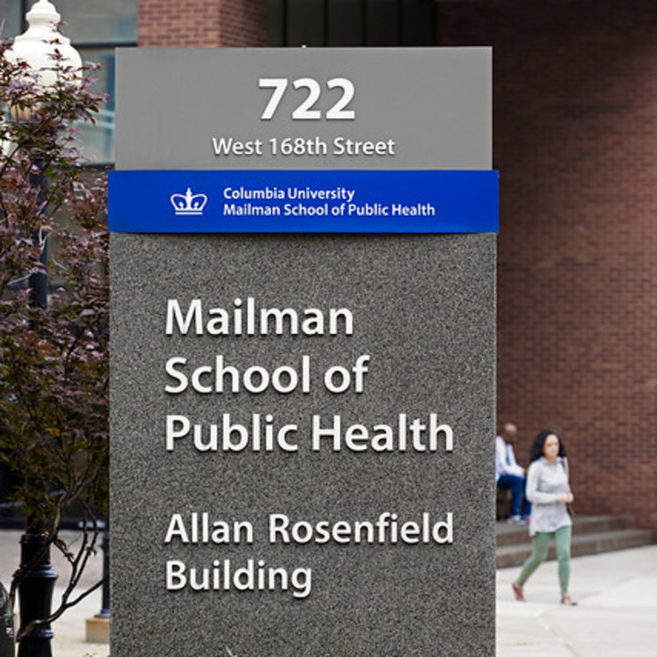

## Introduction

Hi! I am Wenshan Qu. I am currently a Master of Science student at [Columbia University](https://www.columbia.edu/content/academics), [Mailman School of Public Health](http://www.publichealth.columbia.edu/), majoring in [Biostatistics](http://www.publichealth.columbia.edu/academics/departments/biostatistics).  

 

 
My undergraduate major is Biology, and through my 4-year undergraduate study at [Shandong University](https://www.en.sdu.edu.cn/), I gradually found out that my interest lies in tackling public health issues rather than illustrating biological mechanisms. What further pushed me to Biostatistics is the chance that in 2019, I went to UCLA summer session and take a Biostatistics class, learning how to use STATA to manipulating data. Inspired by these factors, I eventually decided to devote my future life and passion into this new major - biostatistics.

 
Though it is really exciting to "play" with data, it is also challenging for me to step in a new academic area. I am now studying how to use **R programming** to clean and tidy data, manipulate and arrange them, visualize data, and finally getting useful information from raw data and representing the results to other people without statistical knowledge in a human-friendly form. 

 
There are still lots of things I need to learn, but I am confident that I have enough passion and competence to overcome the confronted difficulties! 

## Resume

Even my undergraduate major and research projects mainly focus on microbiology, I think it will still be helpful to view my [resume](resume.html) if you want to know more about me!

## Data visualization

[Here](rest_insp.html) is my plotly and flexdashboard results. I deal with the `NYC Restaurant Inspection Results`, and focus on the geographical distinction for grade and score. And simple explanation on the plots can be seen [here](plotly.html).

Also, I am interested in `NOAA` data, so extra outcomes can be found [here](noaa.html). Similarly, this [page](plotly2.html) will provide you with the code and idea of my data manipulation process.

## More contact information

Email: wq2160@cumc.columbia.edu

GitHub: https://github.com/WenshanQu

You can also directly link to these accounts by clicking the button on the top of this page!

